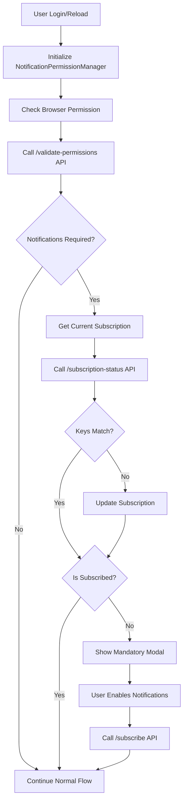

# Notification System Documentation

## Overview

This notification system implements a comprehensive permission checking and enforcement mechanism that:
1. Checks notification permissions on every login and page reload
2. Validates p256dh and auth keys with the backend
3. Updates subscriptions if keys have changed
4. Shows only today's notifications by default
5. Enforces mandatory notifications for specific user roles

## Architecture

### Core Components

#### 1. **API Layer** (`src/lib/utils/api.ts`)
- Added notification-specific types and interfaces
- Created `notificationApi` service with all required endpoints:
  - `checkSubscriptionStatus`: Validates subscription keys
  - `validatePermissions`: Checks if notifications are required
  - `subscribe`: Creates/updates push subscription
  - `getNotifications`: Fetches notifications (today only by default)
  - `markAsRead`, `markAllAsRead`, `deleteNotification`: Notification management

#### 2. **Permission Manager** (`src/lib/utils/notificationPermissionManager.ts`)
- Singleton class that manages notification permissions
- Handles subscription validation and updates
- Checks permissions on login/reload
- Manages forced notification enablement
- Caches permission state to avoid excessive API calls

#### 3. **WebPushClient** (`src/lib/utils/webPushClient.ts`)
- Updated to integrate with new API endpoints
- Validates existing subscriptions before creating new ones
- Handles subscription key comparison and updates

#### 4. **NotificationProvider** (`src/components/notifications/NotificationProvider.tsx`)
- Enhanced React context provider
- Manages notification state across the app
- Integrates with permission manager
- Fetches today's notifications by default
- Handles automatic permission checking on mount and focus

#### 5. **UI Components**

- **MandatoryNotificationModal**: Blocks users when notifications are required but not enabled
- **NotificationPermissionGuard**: Wrapper component that enforces permissions app-wide
- **NotificationPermissionBanner**: Optional banner for requesting permissions

#### 6. **Hooks**

- **useNotificationPermission**: Custom hook for checking and managing permissions in components

## Implementation Flow

### On Login/Reload



### Permission Checking Logic

1. **Initial Check**: On component mount, the system checks:
   - Browser notification permission status
   - Backend validation for user requirements
   - Existing subscription validity

2. **Subscription Validation**: 
   - Compares p256dh and auth keys with backend
   - Updates subscription if keys don't match
   - Creates new subscription if none exists

3. **Enforcement**:
   - Shows mandatory modal if notifications are required but not enabled
   - Blocks user interaction until notifications are enabled
   - Prevents disabling notifications for required accounts

## API Endpoints

### 1. Check Subscription Status
```typescript
GET /api/v1/web-push/subscription-status?endpoint=xxx&p256dh=xxx&auth=xxx
Response: {
  isSubscribed: boolean,
  hasValidSubscription: boolean,
  needsUpdate: boolean,
  subscriptionCount: number
}
```

### 2. Validate Permissions
```typescript
GET /api/v1/web-push/validate-permissions
Response: {
  hasSubscription: boolean,
  requiresPermission: boolean,
  userRole: string,
  message: string
}
```

### 3. Subscribe/Update
```typescript
POST /api/v1/web-push/subscribe
Body: { 
  subscription: { 
    endpoint: string, 
    keys: { p256dh: string, auth: string } 
  } 
}
Response: {
  success: boolean,
  message: string,
  action: 'created' | 'updated' | 'existing'
}
```

### 4. Get Notifications
```typescript
GET /api/v1/notifications?page=1&limit=10&todayOnly=true
Response: {
  notifications: NotificationItem[],
  isToday: boolean,
  total: number,
  unreadCount: number
}
```

## Usage Examples

### 1. Basic App Setup

```tsx
// In your root layout
import { NotificationProvider } from "@/components/notifications/NotificationProvider";
import { NotificationPermissionGuard } from "@/components/notifications/NotificationPermissionGuard";

export default function RootLayout({ children }) {
  return (
    <html>
      <body>
        <NotificationProvider>
          <NotificationPermissionGuard enforcePermission={true}>
            {children}
          </NotificationPermissionGuard>
        </NotificationProvider>
      </body>
    </html>
  );
}
```

### 2. Login Integration

```tsx
import { notificationPermissionManager } from "@/lib/utils/notificationPermissionManager";

const handleLogin = async (credentials) => {
  const response = await loginAPI(credentials);
  
  if (response.success) {
    // Initialize with new auth token
    await notificationPermissionManager.initialize(response.data.accessToken);
    
    // Check and validate permissions
    const state = await notificationPermissionManager.checkAndValidatePermissions(true);
    
    // Handle based on state
    if (state.requiresPermission && !state.isSubscribed) {
      // Modal will automatically show
    }
  }
};
```

### 3. Using in Components

```tsx
import { useNotificationPermission } from "@/hooks/useNotificationPermission";

function MyComponent() {
  const { 
    permissionState,
    isBlocked,
    enableNotifications 
  } = useNotificationPermission({
    checkOnMount: true,
    enforcePermission: true
  });

  if (isBlocked) {
    // Component is blocked, modal will show
    return null;
  }

  // Normal component rendering
}
```

### 4. Fetching Today's Notifications

```tsx
import { useNotifications } from "@/components/notifications/NotificationProvider";

function NotificationList() {
  const { notifications, refreshNotifications } = useNotifications();

  useEffect(() => {
    // This fetches only today's notifications by default
    refreshNotifications();
  }, []);

  return (
    <div>
      {notifications.map(n => (
        <NotificationItem key={n.id} notification={n} />
      ))}
    </div>
  );
}
```

## Configuration

### Permission Check Intervals

- Default check interval: 5 minutes
- Checks on page focus/visibility change
- Forced check on login
- Can be configured via component props

### Notification Filtering

- Default: Shows only today's notifications
- Can be overridden by passing `todayOnly=false` to API calls

### User Role Requirements

- Backend determines which roles require notifications
- Cannot be overridden on frontend
- Enforced through mandatory modal

## Security Considerations

1. **Token Management**: Auth tokens are required for all API calls
2. **Subscription Validation**: Keys are validated on backend before accepting
3. **Permission Enforcement**: Cannot bypass mandatory notifications for required roles
4. **Secure Storage**: Uses localStorage for non-sensitive data only

## Testing

To test the notification system:

1. **Test Permission Flow**:
   - Clear browser notification permissions
   - Login as user with required notifications
   - Verify modal appears and blocks interaction
   - Enable notifications and verify flow continues

2. **Test Key Updates**:
   - Manually change subscription keys in database
   - Reload page
   - Verify system detects mismatch and updates

3. **Test Today's Notifications**:
   - Create notifications with different dates
   - Verify only today's show by default

## Troubleshooting

### Common Issues

1. **Modal not showing**: Check if user role requires notifications in backend
2. **Subscription fails**: Ensure service worker is registered and VAPID keys are correct
3. **Keys not updating**: Verify backend is comparing keys correctly
4. **Notifications not showing**: Check browser permissions and service worker status

## Future Enhancements

1. Add notification categories/filtering
2. Implement notification preferences per category
3. Add notification history beyond today
4. Implement notification grouping
5. Add sound/vibration preferences
6. Implement quiet hours settings
